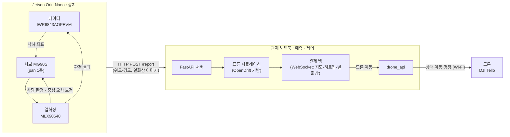

# ARDA — 하천 표류 예측 및 수색 지원 시스템

> 레이더·열화상으로 하천 낙하 사고를 감지하고, 표류 예측으로 우선 수색 구역을 제시하는 시스템

**2026 제22회 인천대 창의적 종합설계 경진대회 장려상** · 팀 ARDA (알다)
인천대학교 임베디드시스템공학과 · 지도교수 최병조

팀 전체 소개: [ARDA-2026](https://github.com/ARDA-2026)

---

## 문제 상황

- 2018년 대비 2024년 한강 교량 투신 시도는 2배 이상 증가했습니다. 마포대교 난간 설치 후 해당 교량은 26.5% 감소했지만 인접 교량 시도는 32.1% 증가했습니다.
- **신고 의존:** 목격자 신고가 없으면 사고 인지 자체가 어렵습니다.
- **표류로 인한 위치 변화:** 유속 초속 2 m에서는 1분 지체 시 120 m 하류로 이동합니다.
- **비효율적 수색:** 구조대원의 79.6%가 '감'에 의존해 위치를 특정하지 못합니다. 실종자의 약 71%가 5일 이내에 발견되고, 이후 구조 성공률이 급격히 떨어집니다.

예방 인프라가 강화된 지금도 사고 직후의 정보 공백은 남아 있습니다.

<sub>출처: 동대문이슈(2025.04.29), 메트로서울(2019.09.02), FPN소방방재신문(2026.04.03)</sub>

## 접근 방법

**감지 → 좌표 확정 → 표류 예측 → 수색**을 사람 개입 없이 한 번에 연결합니다.

| 단계 | 처리 내용 |
| --- | --- |
| 낙하 감지 | 레이더 점군을 필터링·DBSCAN 클러스터링·칼만 필터로 추적하고, 높이 변화(하강 후 소실·높이 감소·자유낙하 패턴)로 낙하 판정. 로지스틱 회귀로 신뢰도(0~1) 산출 |
| 대상 확인 | 서보로 열화상 시야를 정렬하고, 발열 영역의 형태(원형도·가로세로비·채움률) 또는 커스텀 YOLO로 대상 판정. 누적 매칭 3회면 확정, 10초 안에 못 채우면 자동 포기 |
| 좌표 확정 | 방향은 서보 최종 각도에서, 거리는 카메라 높이·각도 기반 삼각측량으로 계산해 최종 위도·경도 산출 |
| 표류 예측 | OpenDrift 기반 표류 시뮬레이션(라그랑지안 파티클 추적)에 확정 좌표와 하천 유속을 반영해 히트맵 생성 |
| 수색 지원 | 입자 분포에서 우선 수색 좌표(Waypoint)를 선정하고 드론에 이동 명령 전송 |

드론은 결과물이 아니라, 예측 좌표가 외부 수색 장비까지 전달되는지 보여주기 위한 대리 기체입니다.

## 결과

- 사고 확정 시간: 팀 시연 환경 기준 평균 10.13초
- 구(球) 타겟으로 낙하 감지를 반복 검증하고, 통제된 환경에서 2 m 높이 점프 3회 모두 낙하 감지 확인
- 드론 비행 세션을 hard-negative로 사용해 레이더 오탐 검증
- 센서 모듈 소비 전력 4~6 W 실측
- 통합 중 레이더·열화상 비동기 타이밍으로 최종 좌표가 유실되던 문제를 녹화 데이터 재생 실험으로 재현하고 대기 시간·경쟁 상태를 수정

## 시스템 구성도



## 사용 기술

| 분류 | 내용 |
| --- | --- |
| 보드 | Jetson Orin Nano |
| 센서·기체 | TI IWR6843AOPEVM (60 GHz FMCW 레이더), MLX90640 열화상, MG90S 서보모터, DJI Tello |
| 감지 | DBSCAN, 칼만 필터, 로지스틱 회귀, YOLO |
| 표류 예측 | OpenDrift, NumPy |
| 관제·통신 | Python, FastAPI, WebSocket, djitellopy |
| 초기 수조 검증 (이 저장소) | OpenDrift, Uber H3, Matplotlib, Raspberry Pi 5 |

## 내 역할

- 관제 웹–드론 연동 및 비행 제어: Waypoint를 이륙 지점 기준 상대 변위 명령으로 변환, Tello 부호 매핑·드리프트·배터리 실측
- 시연 환경 구축
- 초기 수조 표류 예측 검증 파이프라인 구현 (이 저장소): OpenDrift Custom Reader, 반사 경계·수동 확산, H3 격자화

<!-- TODO: 역할 표기 확인 필요 -->

## 시연 영상 · 사진

- 전체 시연 영상: [팀 저장소에서 보기](https://github.com/ARDA-2026/.github/tree/main/profile/assets)
- 센서 구성 사진: [팀 저장소에서 보기](https://github.com/ARDA-2026/.github/tree/main/profile/assets)

<!-- TODO: 드론 비행 사진·히트맵 결과 이미지 추가 -->

---

# 상세: 초기 수조 표류 예측 검증 파이프라인

이 저장소는 강민수 담당 파트로, 프로젝트 초기에 OpenDrift 표류 예측과 Uber H3 격자화 알고리즘을 소형 수조(1m × 0.5m)에서 검증한 파이프라인입니다.

---

## 디렉토리 구조

```
ARDA/
├── config.py                 # 강민수·이다빈 공유 상수 (ENVIRONMENT 분기)
├── smoke_test.py             # 설치 검증 스크립트
├── main_tank.py              # 파이프라인 진입점
├── tank/
│   ├── tank_reader.py        # OpenDrift Custom Reader (수조 유속)
│   ├── tank_model.py         # 수조 전용 OceanDrift 서브클래스
│   └── heatmap_pipeline.py   # 전체 파이프라인 (5단계 체크포인트)
├── shared/
│   ├── h3_utils.py           # H3 빈닝 + 탐색 지점 필터
│   └── output_schema.py      # 이다빈과 공유하는 JSON 출력 스키마
├── tests/
│   ├── test_reader.py        # TankReader 단위 테스트 (4개)
│   ├── test_boundary.py      # 경계 조건 단위 테스트 (2개)
│   └── test_heatmap.py       # H3 빈닝 단위 테스트 (5개)
├── results/                  # 자동 생성: heatmap_*.png, waypoints_*.json
└── requirements_tank.txt
```

---

## 환경 설정

### 요구사항
- Python 3.11+
- Raspberry Pi 5 (Raspberry Pi OS 64-bit Bookworm) 또는 Windows 개발 환경

### 설치

```bash
# 가상환경 생성
python -m venv .venv
.venv\Scripts\activate        # Windows
# source .venv/bin/activate   # Linux / Raspberry Pi

# OpenDrift 의존성 분리 설치 (GDAL 빌드 오류 방지)
pip install opendrift --no-deps
pip install -r requirements_tank.txt
```

### Raspberry Pi 5 추가 설정 (한국어 폰트)

```bash
sudo apt-get install fonts-nanum
```

설치 후 matplotlib 캐시 삭제:
```bash
python -c "import matplotlib; print(matplotlib.get_cachedir())"
rm -rf <위 경로>
```

---

## 사용법

### 설치 검증

```bash
python smoke_test.py
```

정상 출력:
```
파이썬 버전: 3.12.x ...
[확인] OpenDrift: 1.14.9
[확인] h3: 3.7.7
[확인] OceanDrift 불러오기 성공
...
=== 모든 의존성 설치 확인 완료 ===
```

### 단위 테스트

```bash
python tests/test_reader.py
python tests/test_boundary.py
python tests/test_heatmap.py
```

### 전체 파이프라인 실행

```bash
python main_tank.py
```

실행 시간: 약 30~60초 (Raspberry Pi 5 기준)

결과 파일:
- `results/heatmap_YYYYMMDD_HHMMSS.png` — 파티클 밀도 분포 + H3 셀별 확률
- `results/waypoints_YYYYMMDD_HHMMSS.json` — 드론 탐색 지점 목록

---

## 파이프라인 상세

```
[입수 좌표 입력]
    ↓
[체크포인트 1] 파티클 500개 초기화
  - 입수 지점 중심 반경 5cm 내 균등 분포
  - 가짜 GPS 좌표 사용 (TANK_ORIGIN_LAT=37.5, TANK_ORIGIN_LON=126.7)
    ↓
[시뮬레이션 실행: 300초, 1초 타임스텝]
  - TankReader: 수조 펌프 유속 공급 (기본 u=5cm/s, v=1cm/s)
  - TankDriftModel: 이류 → 수동 확산 → 반사 경계 순서 적용
    ↓
[체크포인트 2] 경계 조건 검증 (이탈 파티클 = 0)
    ↓
[체크포인트 3] 활성 파티클 보존율 확인 (>95%)
    ↓
[H3 빈닝] 파티클 위치 → Uber H3 격자 셀 매핑 (해상도 15, 엣지 ~0.5m)
    ↓
[체크포인트 4] H3 커버리지 확인 (셀 1개 이상)
    ↓
[체크포인트 5] 확률 0.5% 이상 셀 → 탐색 지점 추출
    ↓
[시각화] matplotlib hexbin 밀도 분포 + H3 셀별 확률 막대 그래프 저장
    ↓
[JSON 출력] 드론 탐색 지점 목록 저장 (이다빈 공유 스키마)
```

---

## 핵심 설계 결정 및 수정 이력

### TankReader — Custom OpenDrift Reader

- `BaseReader + ContinuousReader` 이중 상속
- 모든 속성을 `super().__init__()` **이전**에 설정 (1.14.9 요구사항)
- `start_time=None, end_time=None` → 시간 범위 없이 항상 유효
- `update_flow(u, v)` 메서드로 실시간 유속 센서 연동 가능

### TankDriftModel — 경계 조건

**반사 경계 (모듈로 방식)**

```
period = 2 × 수조크기
position % period → 후반부는 반사
```

단순 `2×boundary` 공식 대신 모듈로 방식을 사용합니다.
확산으로 파티클이 수조보다 많이 이동할 때 `2×boundary`는 틀린 반사를 적용해 벽에 쌓이는 artifact가 발생합니다.

**수동 확산**

OpenDrift 내장 `horizontal_diffusivity` 설정이 수조 스케일(`1e-6`도 수준)에서 부동소수점 정밀도 손실로 동작하지 않아 직접 구현했습니다.

```python
std_m = sqrt(2 × D × dt)   # D=0.02 m²/s, dt=1s → 0.2m/step
displacement = Normal(0, std_m)  # 각 파티클 독립 난수
```

### H3 격자화

| 환경 | H3 해상도 | 셀 엣지 | 용도 |
|------|----------|--------|------|
| 수조 (1m×0.5m) | 15 | ~0.5m | 검증용 |
| 한강 (실환경) | 10 | ~150m | 이다빈 담당 |

`config.py`의 `ENVIRONMENT` 변수로 자동 분기됩니다.

### OpenDrift 1.14.9 호환성

| 변경 항목 | 기존 방식 | 적용 방식 |
|----------|----------|----------|
| 지형 충돌 비활성화 | `drift:deactivate_stranded_elements` | `general:use_auto_landmask=False` + `environment:fallback:land_binary_mask=0` |
| 버전 확인 | `opendrift.__version__` | `importlib.metadata.version('opendrift')` |
| 수조 좌표 인식 | 육지 판정 (GSHHG 해안선) | `use_auto_landmask=False`로 우회 |

---

## 출력 예시

### 콘솔

```
=== ARDA 수조 파이프라인 시작 ===
설정: 수조 1m×0.5m, 파티클 500개, 300초 시뮬레이션

[체크포인트 1] 파티클 초기화 완료: 500개
[체크포인트 2] 경계 조건 통과: 모든 파티클 수조 내부 확인
[체크포인트 3] 활성 파티클: 500/500 (손실률 0.0%)
[검증] H3 셀 수: 4 (최소 요구: 1)
[체크포인트 4] H3 셀 4개 생성됨
[체크포인트 5] 탐색 지점 4개 (임계값 0.5% 이상)
[시각화] 히트맵 저장: results/heatmap_20260624_xxxxxx.png
[완료] 결과 저장: results/waypoints_20260624_xxxxxx.json

=== 최종 탐색 지점 상위 3개 ===
  순위  1위: H3=a8b8c5a6, 확률=65.80%, 위치=(37.5000014, 126.7000107)
  순위  2위: H3=a8b81259, 확률=19.40%, 위치=(37.5000064, 126.7000035)
  순위  3위: H3=a8b8125b, 확률=13.80%, 위치=(37.4999982, 126.7000029)
```

### JSON 출력 (이다빈 공유 스키마 v1.0.0)

```json
{
  "schema_version": "1.0.0",
  "generated_at": "2026-06-24T...",
  "sim_params": {
    "n_particles": 500,
    "total_time_s": 300,
    "resolution": 15,
    "entry_lat": 37.5000045,
    "entry_lon": 126.7000045,
    "u_pump_ms": 0.05,
    "v_pump_ms": 0.01
  },
  "waypoints": [
    {
      "rank": 1,
      "h3_index": "8f30e0a8b8c5a6b",
      "probability": 0.658,
      "centroid_lat": 37.5000014,
      "centroid_lon": 126.7000107,
      "count": 329
    }
  ]
}
```

---

## 이다빈과의 동기화 항목

| 항목 | 강민수 (수조) | 이다빈 (한강) |
|------|--------------|--------------|
| `N_PARTICLES` | 500 | 500 |
| `WAYPOINT_THRESHOLD` | 0.005 (0.5%) | 0.005 (0.5%) |
| `H3_RESOLUTION` | 15 | 10 |
| JSON 스키마 버전 | `1.0.0` | `1.0.0` |
| JSON 교환 주기 | 매주 금요일 | 매주 금요일 |

`config.py`의 `ENVIRONMENT = 'tank'`는 **로컬에서만 변경**, 절대 커밋 금지.

---

## 기술 스택

| 분류 | 라이브러리 | 버전 |
|------|----------|------|
| 표류 모델 | opendrift | 1.14.9 |
| 격자화 | h3 | 3.7.7 |
| 수치 연산 | numpy | 2.5.0 |
| 시각화 | matplotlib | 3.10.x |
| 플랫폼 | Raspberry Pi 5 (개발: Windows) | Python 3.11+ |

---

## 팀원 담당

| 이름 | 역할 | 담당 |
|------|------|------|
| 곽민지 (팀장) | HW 총괄 | 수조 설계·제작, 케이스 및 결선 |
| 이다빈 | SW / 알고리즘 | 표류 예측 알고리즘, 한강 환경 통합 |
| 윤대준 | 레이더 / 모터 | 레이더 좌표 변환, 서보모터 제어 |
| 김민서 | 열화상 / YOLO | MLX90640, YOLOv8n 연동 |
| 강민수 | 인프라 / 격자화 | Raspberry Pi 5 환경, 히트맵 파이프라인 |

---

*지도교수: 최병조 교수 | 인천대학교 임베디드시스템공학과*
